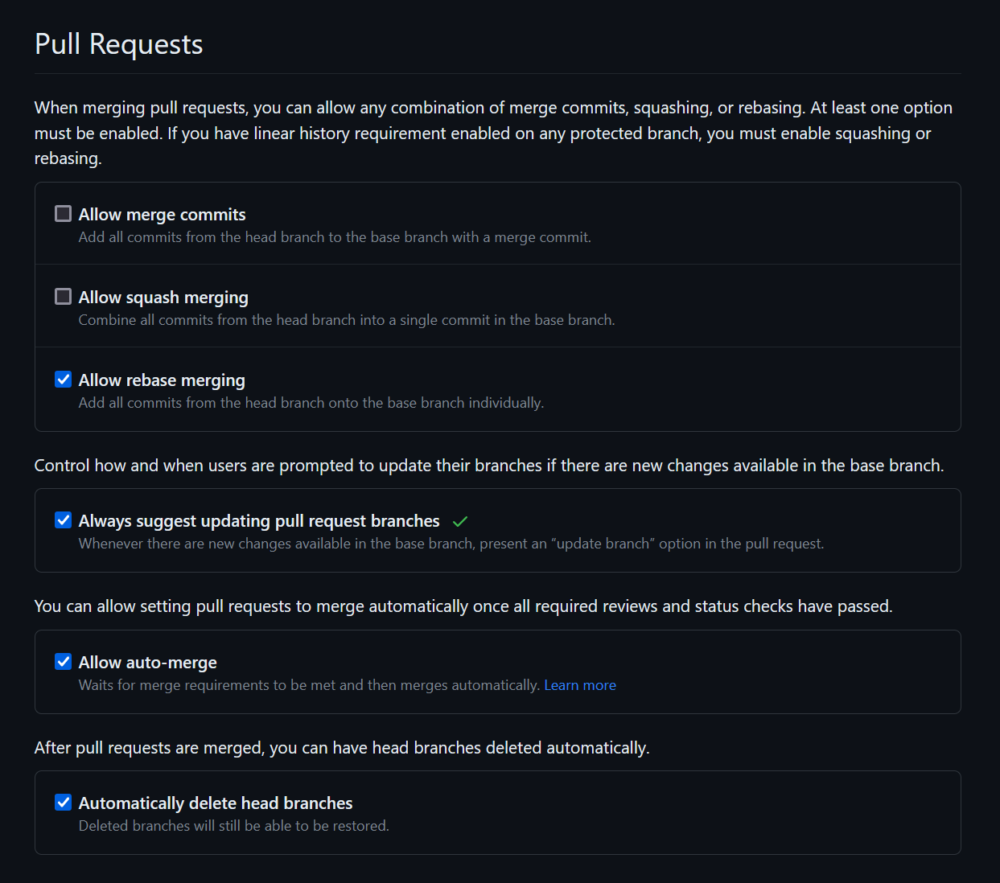
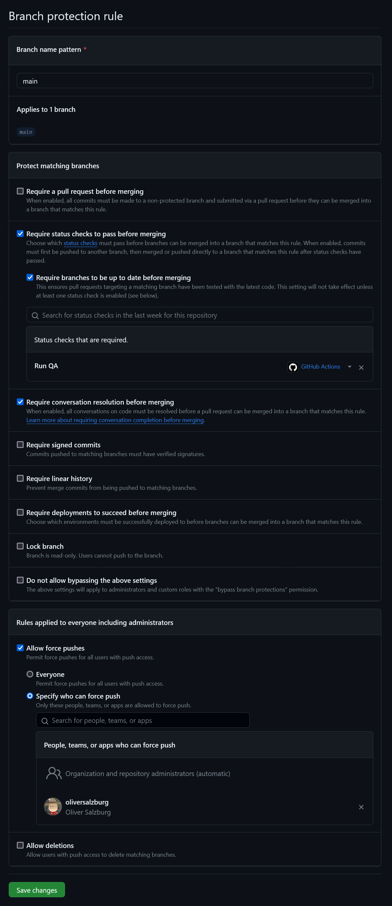
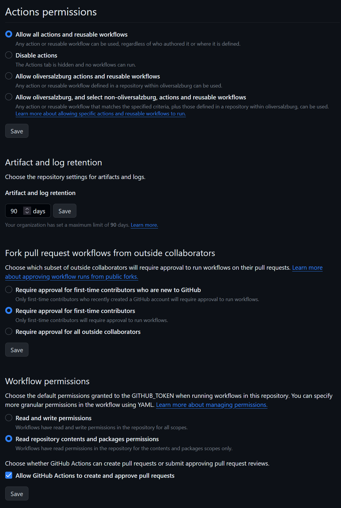

# Project Template

## Does

- [Yarn](https://yarnpkg.com/)
- Uses [TypeScript](https://www.typescriptlang.org/)
- Target application runs in the browser
- [Vite](https://vitejs.dev/) (uses [esbuild](https://esbuild.github.io/))
- [EditorConfig](https://editorconfig.org/) + [Biome](https://biomejs.dev/)
- QA with [GitHub Actions](https://github.com/features/actions)
- [MkDocs](https://www.mkdocs.org/)-oriented Markdown in mind

## GitHub Repository Configuration

Recommended setting for the new repository:

